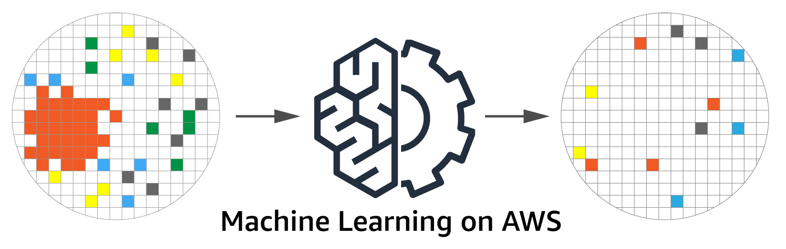

= Semiconductor Wafer Bin Map Classification using AWS Machine Learning



This workshop launches an AWS machine learning and IoT environment that enables customers to develop a deep learning wafer bin map classification model, and use that model for real-time detection on a wafer defect inspection device.

We have many references to publicly available methods and sources, and we extend those by leveraging native AWS Machine Learning Services and IoT tools.


== License Summary

This sample code is made available under the MIT-0 license. See the LICENSE file.

----
Copyright 2019 Amazon.com, Inc. or its affiliates. All Rights Reserved.
SPDX-License-Identifier: MIT-0
----

== Defect Patterns

A wafer bin map shows a visual representation of failed dies across a wafer, that have been put in categories or bins. The maps are created with precise equipment, that can fail or fall out of tolerances. Both <<one>> and <<two>> discuss how wafer bin maps can be classified in to nine main categories:  Center, Donut, Edge-Loc, Edge-Ring, Loc, Random, Scratch, Near-full and none. __Figure 1__ is a visual representation of each.

.Nine wafer bin map classifications
[#wafter-classifications]
[caption="Figure 1: "]

{nbsp}

To ensure the highest possible yields, the foundry will use these classifications to find defect patterns and make adjustments or repairs to semiconductor manufacturing equipment.

This workshop has two parts:

1. Use existing wafer data to build an ML Deep Learning model to classify and validate the model is working correctly
2. Exetend the environment using IoT to do real-time detection.


== Data set attribution

The wafer data is the WM-811k data set which consists of 811,457 wafer maps, and is real data from a actual foundry. This data set available for public download in two places:

- <<Qingyi>>

- <<MIR_Lab>>

== Architecture


=== IoT 

Each device (a Raspberry Pi) runs the GreenGrass Core software.  Devices publish two kinds of messages:

- Raw images.  These go to the topic `fabwafer/<fabid>/<cameraid>/img/<imgid>`.
- Classifications.  These go to the topic `fabwafer/<fabid>/<cameraid>/prediction/<imgid>`

Here are some sample messages you can send to the topic `fabwafer/faba/camera1/prediction/img1` to test the notifications.  The first two should not cause an alert, but the last should.  All should write into the DynamoDB table.

```
{
  "imgid": "img1",
  "timestamp": 1554134552944,
  "fab": "faba",
  "camera": "camera1",
  "prediction": "none",
  "probability": 0.9
}
{
  "imgid": "img2",
  "timestamp": 1554134552945,
  "fab": "faba",
  "camera": "camera1",
  "prediction": "loc",
  "probability": 0.4
}
{
  "imgid": "img3",
  "timestamp": 1554134552946,
  "fab": "faba",
  "camera": "camera1",
  "prediction": "loc",
  "probability": 0.9
}
```

For the raw image topic, here's a link:raw_image_topic.adoc[sample message].

=== DynamoDB

The classification table schema is:

- imgid (hash key)
- timestamp (range key)
- fab
- camera
- prediction
- probability

== Data

The source data is from the Kaggle competition.  Place this data into an S3 bucket organized into `train` and `valid` subdirectories.  The notebook `DataPrep.ipynb` documents the data preparation steps.

== Setup

First, create an S3 bucket to hold the CloudFormation templates.

----
aws s3 mb s3://<template bucket>
----

Now create the stack:

----
./scripts/create.sh <template bucket> <template prefix> <stack name> <region>
----

Note the CodeCommit repo output from the stack and check in the code from the `pytorch_code`, `test_code`, `deploy_code`, and `trainer_code` directories.

----
cd ..
git clone <clone URL>
cd ChipWaferMLRepo
cp -r ../ChipWaferAnalysis/pytorch_code/ .
git add .
git commit -m "First commit.  Trying out the build process."
git push -u origin master

cd ..
git clone <training repo clone URL>
cd ChipWaferTrainRepo
cp -r ../ChipWaferAnalysis/trainer_code/ .
git add .
git commit -m "First commit.  Trying out the build process."
git push -u origin master

cd ..
git clone <test repo clone URL>
cd ChipWaferTestRepo
cp -r ../ChipWaferAnalysis/test_code/ .
git add .
git commit -m "First commit.  Trying out the build process."
git push -u origin master

cd ..
git clone <deploy repo clone URL>
cd ChipWaferDeployRepo
cp -r ../ChipWaferAnalysis/deploy_code/ .
git add .
git commit -m "First commit.  Trying out the build process."
git push -u origin master
----

Now go into the GreenGrass console and deploy the group.  You'll need to deploy the group if the Lambda function changes.  

Next go to the `API Gateway` console, select the proper API, go to the `Resources` section, and select `Deploy API` from the `Actions` menu.  Set the `Deployment stage` to `test`.

Next, create a Cognito user for the review portal.

----
 ./scripts/set-user-password.sh <user email> <password> <user pool id> <client id> <group name>
----

You can obtain the user pool ID, client ID, and group name from the CFN output.  The other parameters are at your discretion.

Finally, build and load the React app.  Adjust any necessary values in `frontend/src/config.js`.

----
cd frontend
npm install # only needed once
npm run build
aws s3 sync build/ s3://<app bucket>
----

=== Updating stack

You can update the stack by passing the `--update` flag.

If you update the GreenGrass elements, reset the deployment on the group.  Then update the stack and redeploy the group.  If you update the Lambda function you must also update the subscription definition.

----
./scripts/create.sh <template bucket> <template prefix> <stack name> <region> --update
----

=== Setting up inference on Raspberry Pi

The automated demo right now runs a GreenGrass core device on an EC2 instance.  It calls the SageMaker inference endpoint.  

If you'd rather do inference on a real device, you can configure a Raspberry Pi.

* Build an MxNet model.  (Eventually we can compile the PyTorch model using SageMaker Neo, but Neo https://github.com/awslabs/amazon-sagemaker-examples/issues/642[does not yet support Pytorch 1.0].)
** Run the notebook `notebooks/Classify-MxNet-121.ipynb`.  This notebook builds a model using MxNet 1.2.1 and saves the artifacts.  Grab the exported artifacts, zip them up, and save them in S3.
** Alternatively, run the notebook `notebooks/Classify-MxNet-SM.ipynb`.  This notebook trains the model in SageMaker, and the model artifact is automatically saved in S3.
* Follow the basic https://docs.aws.amazon.com/greengrass/latest/developerguide/gg-gs.html[Raspberry Pi setup tutorial] (parts 1 and 2).
* Follow the https://docs.aws.amazon.com/greengrass/latest/developerguide/ml-console.html[tutorial] on deploying inference on the device using MxNet.
** Copy the `test` image folder onto the device in the path `/opt/images/test`
** Starting with the lambda zip package you got from the tutorial, replace the `greengrassObjectClassification.py` with the version in the folder `lambda-rpi-inference` and rebuild the zip file.
** When you deploy the Lambda function, set environment variables for the fab, camera, and inference interval.
** Add a file system resource that maps `/opt/images` to `/volumes/images`.  Don't bother with the camera resources.
** Use the model artifact created from the MxNet notebook.  The local path should be `/greengrass-machine-learning/mxnet/wafers`.

Also note that the Pi needs a 2.5 power source when you run inference.  If you use a lesser power source, it'll boot and seem to work, but it'll crash when you invoke any neural network for inference.

== Resources

- https://docs.aws.amazon.com/greengrass/latest/developerguide/ml-dlc-console.html[GreenGrass ML Inference Guide]

== Improvement list

- Run ML training jobs on multiple instances
- Use native PyTorch container rather than custom version (standardizes on fastai 1.0.39)
- Improve accuracy of MxNet model.  It should probably not use `CenterCrop` as the cropping strategy; need to identify other deltas compared to the PyTorch model.
- Use incremental training rather than full training every time, pulling in manually reviewed data.
- Work on class imbalance problem.  Consider oversampling, a different loss function, or an imbalanced sampler.  The imbalanced sampler seems to work well but it's very slow right now.

== ML Metrics

.Metrics
|===
|Model |Resnet 34 |Resnet 34 with imbalanced sampling

|Accuracy
|97.8
|94.2

|F1
|97.8
|94.8

|Macro F1
|88.5
|82.4

|Binary accuracy
|98.4
|94.9

|Binary precision
|97
|74.7

|Binary recall
|92
|98.7

|Worst class accuracy
|75
|84
|===

[bibliography]
== References

- [[[one,1]]] Mark H. Hansen, Vijayan N. Nair & David J. Friedman (1997) Monitoring Wafer Map Data From Integrated Circuit Fabrication Processes for Spatially Clustered Defects, Technometrics, 39:3, 241-253, DOI: https://doi.org/10.1080/00401706.1997.10485116[10.1080/00401706.1997.10485116]

- [[[two,2]]] C. H. Jin, H. J. Na, M. Piao, G. Pok and K. H. Ryu, "A Novel DBSCAN-Based Defect Pattern Detection and Classification Framework for Wafer Bin Map," in IEEE Transactions on Semiconductor Manufacturing, vol. 32, no. 3, pp. 286-292, Aug. 2019. doi: 10.1109/TSM.2019.2916835 URL: http://ieeexplore.ieee.org/stamp/stamp.jsp?tp=&arnumber=8713928&isnumber=8765845

- [[[Qingyi]]] https://www.kaggle.com/qingyi (February 2018). WM-811K wafer map, Version 1. Retrieved January 2018 from https://www.kaggle.com/qingyi/wm811k-wafer-map/downloads/wm811k-wafer-map.zip/1.

- [[[MIR_Lab]]] Data Set [WM-811K(LSWMD)] http://mirlab.org/dataSet/public/


